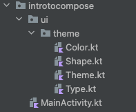

# Struktura projektu w Android Studio

Wybrałem opcję `Empty Compose Activity`.

```kotlin
class MainActivity : ComponentActivity() {

    override fun onCreate(savedInstanceState: Bundle?) {
        super.onCreate(savedInstanceState)
        setContent {
            IntroToComposeTheme {
                // A surface container using the 'background' color from the theme
                Surface(modifier = Modifier.fillMaxSize(), color = MaterialTheme.colors.background) {
                    Greeting("Android")
                }
            }
        }
    }
}

@Composable
fun Greeting(name: String) {
    Text(text = "Hello $name!")
}

@Preview(showBackground = true)
@Composable
fun DefaultPreview() {
    IntroToComposeTheme {
        Greeting("Android")
    }
}
```

Wygenerowało strukturę:


W Color.kt mamy

```kotlin
import androidx.compose.ui.graphics.Color

val Purple200 = Color(0xFFBB86FC)
val Purple500 = Color(0xFF6200EE)
val Purple700 = Color(0xFF3700B3)
val Teal200 = Color(0xFF03DAC5)
```

W Shape.kt mamy:

```kotlin
import androidx.compose.foundation.shape.RoundedCornerShape
import androidx.compose.material.Shapes
import androidx.compose.ui.unit.dp

val Shapes = Shapes(
    small = RoundedCornerShape(4.dp),
    medium = RoundedCornerShape(4.dp),
    large = RoundedCornerShape(0.dp)
)
```

W Theme.kt

```kotlin
import androidx.compose.foundation.isSystemInDarkTheme
import androidx.compose.material.MaterialTheme
import androidx.compose.material.darkColors
import androidx.compose.material.lightColors
import androidx.compose.runtime.Composable

private val DarkColorPalette = darkColors(
    primary = Purple200,
    primaryVariant = Purple700,
    secondary = Teal200
)

private val LightColorPalette = lightColors(
    primary = Purple500,
    primaryVariant = Purple700,
    secondary = Teal200

    /* Other default colors to override
    background = Color.White,
    surface = Color.White,
    onPrimary = Color.White,
    onSecondary = Color.Black,
    onBackground = Color.Black,
    onSurface = Color.Black,
    */
)

@Composable
fun IntroToComposeTheme(darkTheme: Boolean = isSystemInDarkTheme(), content: @Composable () -> Unit) {
    val colors = if (darkTheme) {
        DarkColorPalette
    } else {
        LightColorPalette
    }

    MaterialTheme(
        colors = colors,
        typography = Typography,
        shapes = Shapes,
        content = content
    )
}
```

W Type.kt

```kotlin
import androidx.compose.material.Typography
import androidx.compose.ui.text.TextStyle
import androidx.compose.ui.text.font.FontFamily
import androidx.compose.ui.text.font.FontWeight
import androidx.compose.ui.unit.sp

// Set of Material typography styles to start with
val Typography = Typography(
    body1 = TextStyle(
        fontFamily = FontFamily.Default,
        fontWeight = FontWeight.Normal,
        fontSize = 16.sp
    )
    /* Other default text styles to override
    button = TextStyle(
        fontFamily = FontFamily.Default,
        fontWeight = FontWeight.W500,
        fontSize = 14.sp
    ),
    caption = TextStyle(
        fontFamily = FontFamily.Default,
        fontWeight = FontWeight.Normal,
        fontSize = 12.sp
    )
    */
)
```


